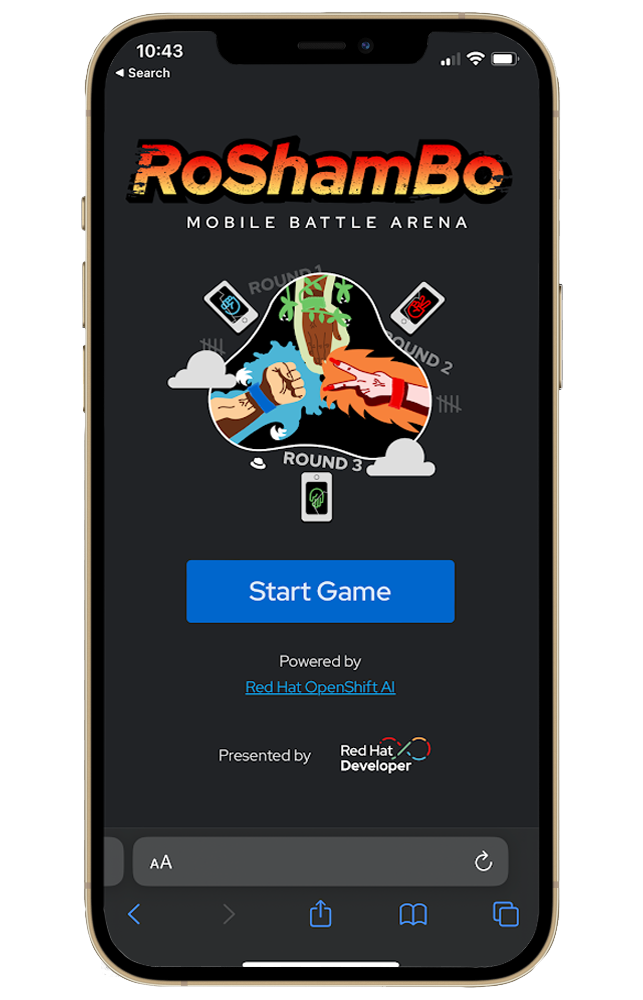
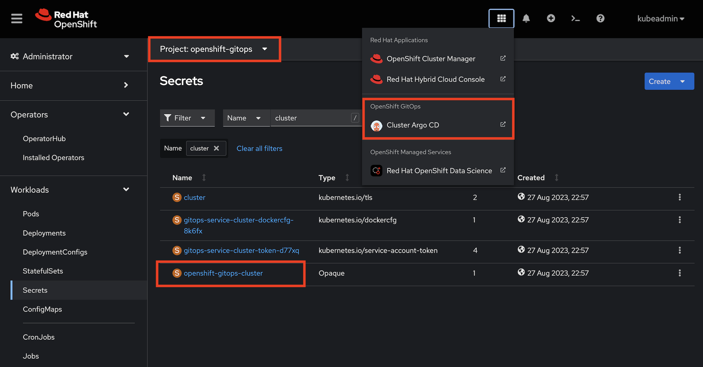
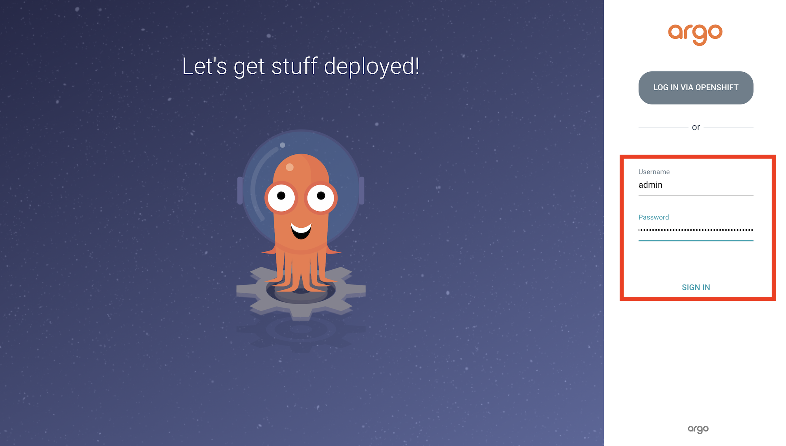
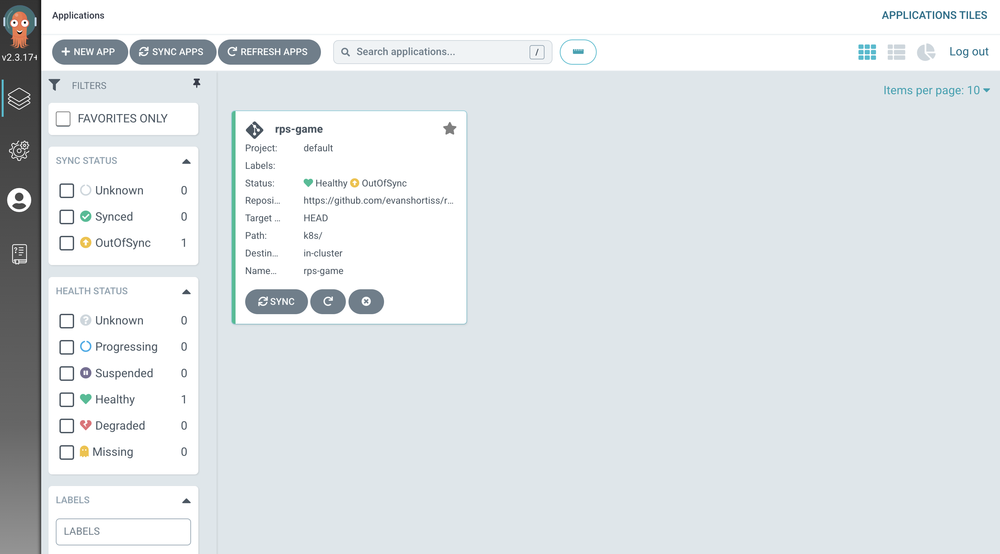

# Rock Paper Scissors Game

Welcome to the Rock Paper Scissors game powered by [Red Hat OpenShift AI](https://red.ht/openshift_ai)! :rocket:

This game uses a Quarkus backend and a React frontend. The game integrates machine learning models to process your move, giving it a modern twist to the classic game! 

<div align="center">

</div>

## Getting Started

These instructions will get you a copy of the project up and running on your local machine for development and testing purposes.

### Prerequisites

Before you begin, you will need to have the following installed:

- Node.js (v18 or v20) and npm
- Java Development Kit (v17)
- Maven

Optionally, you might want to the Quarkus backend upload captures images to AWS
S3. This requires creating an S3 bucket and configuring an IAM user with write
access to the bucket. Check the backend README for more information.

### Local Development

- Clone the repository to your local machine.
- Navigate to the root directory of the project.
- Install frontend dependencies using `npm install` in the frontend directory (`roshambo-ui`).
- Install backend dependencies using `mvn install` in the backend directory (`roshambo-backend`).
- Start the Quarkus backend using `./mvnw quarkus:dev`.
- Start the React development server using `npm run dev`.
- Visit http://localhost:5173 in your web browser to view the application (view the README in the `roshambo-ui` folder for details about SSL and iOS Camera access)

## Deployment on OpenShift

This requires an OpenShift cluster that you have access to a user with `cluster-admin` access.

### Install OpenShift GitOps

1. Login to the OpenShift cluster's web console as the user with `cluster-admin` permission.
1. Select the **Administrator** perspective.
1. Expand the **Operators** section and select **Operator Hub**.
1. Type `openshift gitops` in the search box and click the *Red Hat OpenShift GitOps* operator from the list.
1. Follow the prompts to install the `stable` version of the operator.

Once the Operator is ready you can find the link to Argo CD (provided and managed by OpenShift GitOps) in the **Application Launcher**. The password to login as the `admin` user can be found in the `openshift-gitops-cluster` Secret in the `openshift-gitops` namespace as shown:

<div align="center">

</div>

### Deploy the Roshambo Application

1. Login to the Argo CD instance using the username `admin` and the password you obtained from the `openshift-gitops-cluster` Secret in the `openshift-gitops`.
    
1. Click the **New App** button. An overlay appears.
1. Click the **Edit as YAML** button in the overlay.
1. Paste in the following YAML:
    ```yaml
    apiVersion: argoproj.io/v1alpha1
    kind: Application
    metadata:
      name: rps-game
    spec:
      destination:
        name: ''
        namespace: rps-game
        server: 'https://kubernetes.default.svc'
      source:
        path: k8s
        repoURL: 'https://github.com/redhat-developer-demos/rps-game'
        targetRevision: HEAD
        directory:
          recurse: true
      project: default
      syncPolicy:
        automated:
          prune: true
          selfHeal: true
        syncOptions:
          - CreateNamespace=true
    ```
1. Click **Save**, then click **Create**.
    

**NOTE:** If you did not use the default namespace specified in the Argo CD Application YAML above, you will need to edit the `rps-game` namespace portion of the `RPS_BACKEND_HOST` variable in the *k8s/frontend.deployment.yaml* file. Failure to do this will prevent the frontend from communicating with the backend!

## Built With

- [React](https://react.dev) - The web framework used.
- [TypeScript](https://www.typescriptlang.org) - The main language for the frontend.
- [XState](https://xstate.js.org/docs/) - State management for the frontend, and bot players.
- [Quarkus](https://quarkus.io) - Used for the backend.
- [Tailwind CSS](https://tailwindcss.com) - Used for styling.

## Contributing

If you'd like to contribute, please fork the repository and use a feature branch. Pull requests are warmly welcome.

## Authors

- [Alex Soto Bueno](https://twitter.com/alexsotob) (Backend)
- [Evan Shortiss](https://twitter.com/evanshortiss) (Frontend)
- [Cedric Clyburn](https://twitter.com/cedricclyburn) (Frontend)
- [Chris Chase](https://twitter.com/chaseredhat) (AI Model)

## License

This project is licensed under the Apache License 2.0 - see the LICENSE.md file for details.
