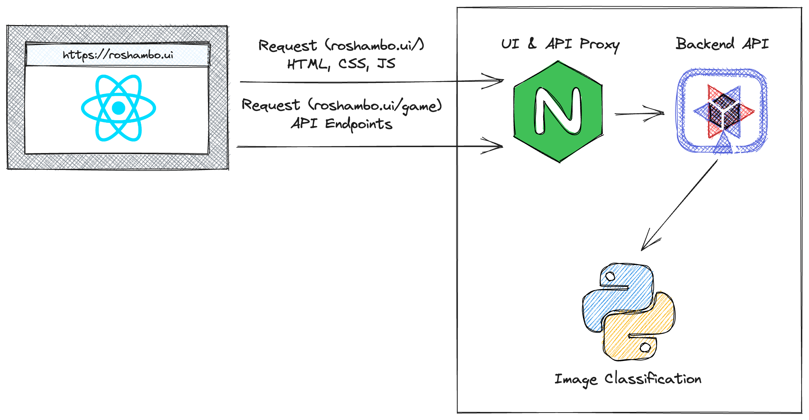

# Rock Paper Scissors Game

Welcome to the Rock Paper Scissors game powered by [Red Hat OpenShift AI](https://red.ht/openshift_ai)! :rocket:

This game uses a Quarkus backend and a React frontend. The game integrates machine learning models to process your move, giving it a modern twist to the classic game! 

## Architecture Overview

The Quarkus backend provides a configuration payload to the UI. This payload
includes a [feature flag](https://en.wikipedia.org/wiki/Feature_toggle) that
will enable or disable an image recognition feature. You can find this
configuration in the Qukarus _application.properties_ file. Enabling this
feature will allow users to take pictures of their hand to select rock, paper,
or scissors. The image is sent to a Python service (code in _roshambo-ai_ folder)
that uses a model provided by OpenShift AI to determine the user's selection.

## Getting Started

These instructions will get you a copy of the project up and running on your local machine for development and testing purposes.

### Prerequisites

Before you begin, you will need to have the following installed:

- Node.js (v18 or v20) and npm
- Java Development Kit (v17)
- Maven

Optionally, you might want to the Quarkus backend upload captured images to AWS
S3. This requires creating an S3 bucket and configuring an IAM user with write
access to the bucket. Check _roshambo-backend/README.md_ for more information.

### Local Development

- Clone the repository to your local machine.
- Navigate to the root directory of the project.
- Install frontend dependencies using `npm install` in the frontend directory (`roshambo-ui`).
- Install backend dependencies using `mvn install` in the backend directory (`roshambo-backend`).
- Start the Quarkus backend using `./mvnw quarkus:dev`.
- Start the React development server using `npm run dev`.
- Visit http://localhost:5173 in your web browser to view the application (view the README in the `roshambo-ui` folder for details about SSL and iOS Camera access)

## Deployment on OpenShift

Refer to the [redhat-developer-demos/rps-game-manifests repository](https://github.com/redhat-developer-demos/rps-game-manifests).

## Built With

- [React](https://react.dev) - The web framework used.
- [TypeScript](https://www.typescriptlang.org) - The main language for the frontend.
- [XState](https://xstate.js.org/docs/) - State management for the frontend, and bot players.
- [Quarkus](https://quarkus.io) - Used for the backend.
- [Tailwind CSS](https://tailwindcss.com) - Used for styling.

## Contributing

If you'd like to contribute, please fork the repository and use a feature branch. Pull requests are warmly welcome.

## Authors

- [Alex Soto Bueno](https://twitter.com/alexsotob) (Backend)
- [Evan Shortiss](https://twitter.com/evanshortiss) (Frontend)
- [Cedric Clyburn](https://twitter.com/cedricclyburn) (Frontend)
- [Chris Chase](https://twitter.com/chaseredhat) (AI Model)

## License

This project is licensed under the Apache License 2.0 - see the LICENSE.md file for details.
